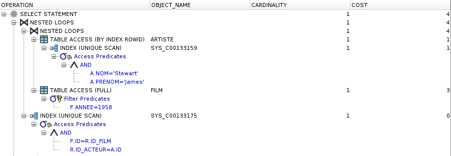
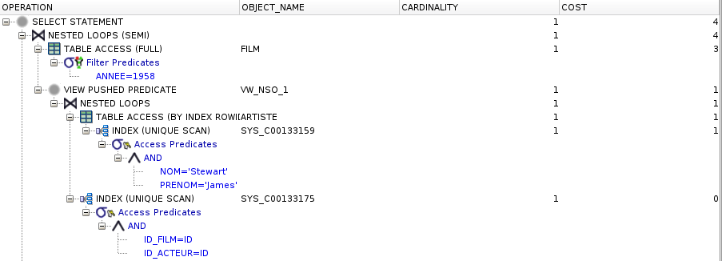

# TP2 - DOC
_13/11/2017_

## Plan d'éxecution

### 7.

### 8.
**TABLE ACCESS FULL** :

Cette opération est aussi connue sous le nom de parcours complet de table. Elle lit la table entière, toutes les lignes et toutes les colonnes, comme elle est stockée sur le disque. Bien que les opérations multi-blocs accélèrent fortement la rapidité d'un parcours complet de table, c'est l'une des opérations les plus coûteuses. En dehors de gros taux d'entrées/sorties, un parcours complet de table doit inspecter toutes les lignes de la table, donc il peut aussi consommer beaucoup de temps processeur.

### 9.

La stratégie utilisé pour cette requête est **HASH JOIN** :

La jointure de hachage charge les enregistrements candidats d'un côté de la jointure dans une table de hachage qui est ensuite sondée pour chaque ligne de l'autre côté de la jointure.

Comme on a que des **ACCESS FULL** on a pas d'index.

### 10.

**UNIQUE SCAN** :

L'opération INDEX UNIQUE SCAN réalise un parcours seul du B-tree. La base de données utilise cette opération si une contrainte unique assure que le critère de recherche correspondra à pas plus d'une entrée.

**BY ROWID** :

Récupère une ligne à partir de la table en utilisant le ROWID (l'identifiant interne de la ligne) récupéré lors d'une recherche précédente dans l'index.

### 11.

Il fait la jointure sur les deux tables complète (film et artiste) alors qu'on pourrait restreindre le nombre de lignes avant de faire la jointure.

### 12.

### 13.

### 14.

Non on a pas de différence.

### 15.

Non il n'y a pas de différences

### 16.

### 17.
La façon d'écrire la requête impacte fortement la façon dont l'optimiseur va exécuter la requête. Il faut au maximum essayer de minimiser les ensembles de lignes avant de faire des jointures.

### References
http://use-the-index-luke.com/fr/sql/plans-dexecution/oracle/operations
